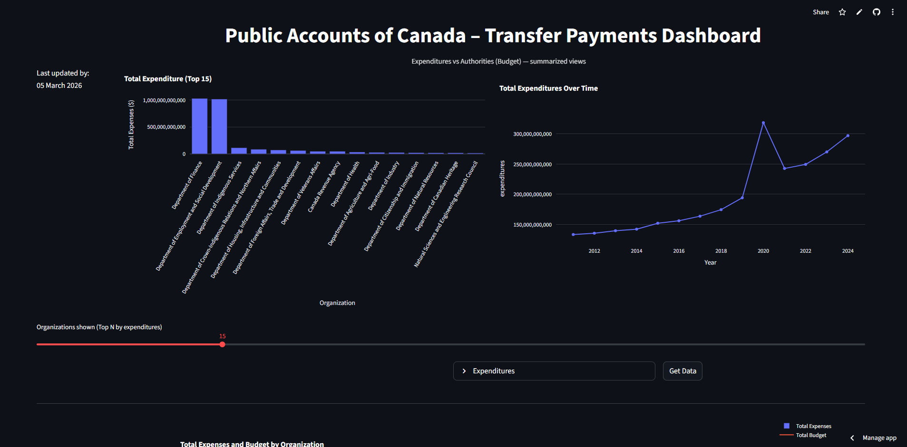

# Canada Public Spending Dashboard

An interactive data dashboard analyzing Canadian Public Accounts transfer payment data using Python, Pandas, Plotly, and Streamlit.

The dashboard helps users explore government transfer payment spending by organization, fiscal year, and budget authority. It compares actual expenditures against authorized spending to make public finance data easier to understand and analyze.

Live Dashboard:
https://canada-public-spending-dashboard.streamlit.app/

---

## Features

- View **total expenditures by government organization**
- Track **spending trends over time**
- Compare **expenditures vs authorized budgets**
- Interactive filtering of top organizations
- Downloadable data tables

---

## Tech Stack

- Python
- Pandas
- Plotly
- Streamlit

---

## Dataset

Data sourced from the **Public Accounts of Canada – Transfer Payments** dataset.

The dataset contains information about:

- Government organizations
- Fiscal years
- Transfer payment expenditures
- Authorized spending (authorities)

---

## Running the Project Locally

Clone the repository:

```bash
git clone https://github.com/FJamal1200/canada-public-accounts-dashboard.git
